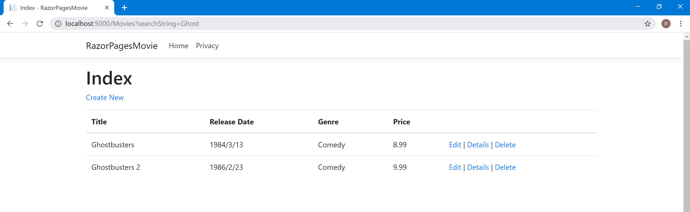

# ASP.NET Core  Web  Razor Pages系列教程：使用ASP.NET Core创建Razor Pages Web应用程序
ASP .Net Core Razor Pages MySQL Tutorial

*本系列教程翻译自微软官方教程，官方教程地址：[Tutorial: Create a Razor Pages web app with ASP.NET Core | Microsoft Docs](https://docs.microsoft.com/en-us/aspnet/core/tutorials/razor-pages/?view=aspnetcore-2.2)*

本系列教程介绍了构建Razor Pages Web应用程序的基础知识。

本教程基于 `VS2019`和 `.NET Core 2.2`。

*2019-6-9：VS2017因为存在BUG，不能安装 .NET Core 2.2，对此教程影响不大*

本系列包括以下教程：

* [ASP.NET Core Web  Razor Pages系列教程一：使用ASP.NET Core 创建一个Razor Pages网络应用程序](https://blog.csdn.net/zhangpeterx/article/details/91347594)
* [ASP .NET Core Web  Razor Pages系列教程二：添加模型到Razor Pages网络应用程序](https://blog.csdn.net/zhangpeterx/article/details/91347657)
* [ASP .NET Core Web  Razor Pages系列教程三：自动生成Razor Pages (CRUD)](https://blog.csdn.net/zhangpeterx/article/details/91347701)
* [ASP .NET Core Web Razor Pages系列教程四：使用数据库进行交互（SqlServer 版）](https://blog.csdn.net/zhangpeterx/article/details/91347728)
* [ASP .NET Core Web Razor Pages系列教程四：使用数据库进行交互（MySQL/MariaDB 版）](https://blog.csdn.net/zhangpeterx/article/details/91351161)
* [ASP .NET Core Web Razor Pages系列教程五：更新Razor Pages页面](https://blog.csdn.net/zhangpeterx/article/details/91347747)
* [ASP.NET Core  Web  Razor Pages系列教程六：添加搜索功能](https://blog.csdn.net/zhangpeterx/article/details/91347761)
* [ASP.NET Core Web  Razor Pages系列教程七： 添加新的字段](https://blog.csdn.net/zhangpeterx/article/details/91347780)
* [ASP.NET Core Web  Razor Pages系列教程八： 添加验证](https://blog.csdn.net/zhangpeterx/article/details/91347787)

最后，您将拥有一个可以显示和管理电影数据库的应用程序：   



项目运行方法：   

```js
git clone https://github.com/zhang0peter/ASPNetCoreRazorPagesMySQLTutorial.git
cd ASPNetCoreRazorPagesMySQLTutorial/
dotnet run
```
**注意修改appsettings.json中的数据库连接字符串为自己的数据库地址**